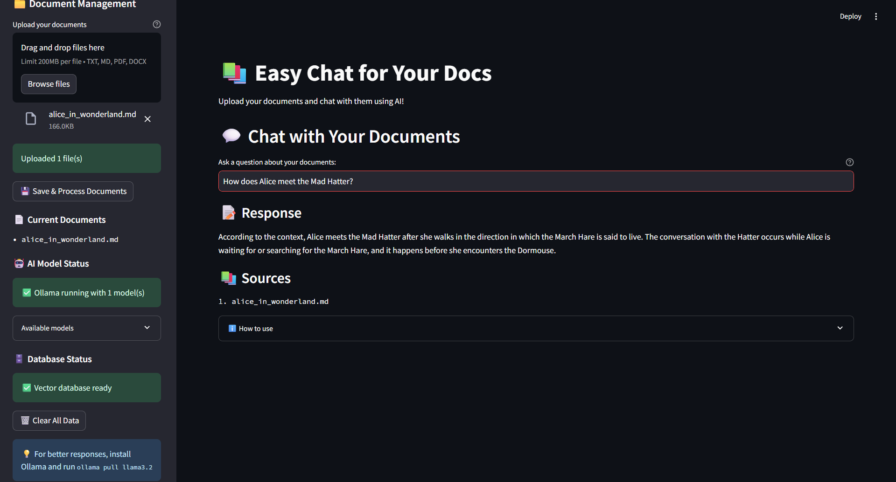

# 📚 Document Chat App

А local-first Retrieval-Augmented Generation (RAG) application that lets you upload, process, and chat interactively with your documents using AI. Built with Streamlit, LangChain, and ChromaDB, it supports multiple AI backends including Ollama and Hugging Face Transformers—enabling private, offline, and powerful document question answering.


## 🖼️ App Preview



## ✨ Features

- 📄 **Multi-format support**: PDF, DOCX, TXT, and Markdown files
- 🤖 **Multiple AI backends**: Ollama (recommended), Hugging Face Transformers, fallback text extraction
- 🔍 **Smart search**: Vector-based similarity search with ChromaDB
- 💬 **Interactive chat**: Web-based interface powered by Streamlit
- 🔒 **Privacy-first**: All processing happens locally (no data sent to external APIs)
- ⚡ **Easy setup**: No Docker required, simple Python installation
- 🛠️ **Easy debugging**: Direct Python execution for development

## 🚀 Quick Start

### Prerequisites

- Python 3.8 or higher
- Git (to clone the repository)

### Installation

1. **Clone the repository**
   ```bash
   git clone <your-repo-url>
   cd document-chat-app
   ```

2. **Create and activate virtual environment** (recommended)
   ```bash
   python -m venv venv
   
   # On Windows
   venv\Scripts\activate
   
   # On macOS/Linux
   source venv/bin/activate
   ```

3. **Install dependencies**
   ```bash
   pip install -r requirements.txt
   ```

4. **Run the application**
   ```bash
   streamlit run app.py
   ```

The app will open in your browser at `http://localhost:8501`

## 🤖 Enhanced AI Setup (Optional but Recommended)

For the best chat experience, install Ollama:

### Install Ollama
1. Visit [ollama.ai](https://ollama.ai) and download for your operating system
2. Install and start Ollama
3. Pull a model:
   ```bash
   # Recommended model
   ollama pull llama3.2
   
   # Alternative options
   ollama pull llama3.2:1b    # Smaller, faster
   ollama pull llama3.1:8b    # Larger, more capable
   ```

### Why Ollama?
- 🧠 **Smarter responses** - Much better than fallback models
- 🔒 **Completely private** - No data leaves your machine
- 💰 **Free** - No API keys or costs
- 🌐 **Offline** - Works without internet

## 📖 How to Use

1. **Start the app**: `streamlit run app.py`
2. **Upload documents**: Use the sidebar to upload PDF, DOCX, TXT, or MD files
3. **Process documents**: Click "Save & Process Documents"
4. **Ask questions**: Type questions about your documents in the main interface

### Detailed Usage

1. **Start the application**
   ```bash
   streamlit run app.py
   ```
   The app will open in your browser at `http://localhost:8501`

2. **Upload documents**
   - Use the sidebar file uploader
   - Supported formats: PDF, DOCX, TXT, MD
   - Multiple files can be uploaded at once

3. **Process documents**
   - Click "💾 Save & Process Documents"
   - Wait for the vector database to be created

4. **Start chatting**
   - Type questions in the main text input
   - Get AI-powered answers based on your documents
   - View source documents for each response

## 🏗️ Project Structure

```
document-chat-app/
├── app.py                 # Main Streamlit application
├── create_database.py     # Creates vector database from documents
├── query_data.py         # Handles RAG queries
├── document_loader.py    # Loads various document types
├── requirements.txt      # Python dependencies
├── .env                  # Environment variables (optional)
├── .env.example         # Environment template
├── README.md            # This file
├── data/
│   └── docs/            # Place your documents here (auto-created)
└── chroma/              # Vector database storage (auto-created)
```

## ⚙️ Configuration

### Environment Variables

Create a `.env` file (optional):

```env
# Optional: Hugging Face token for some models
HUGGINGFACEHUB_API_TOKEN=your_token_here

# Optional: Custom paths
DATA_PATH=data/docs
CHROMA_PATH=chroma
```

### Supported File Types

| Format | Extension | Description |
|--------|-----------|-------------|
| Text | `.txt` | Plain text files |
| Markdown | `.md` | Markdown formatted text |
| PDF | `.pdf` | Portable Document Format |
| Word | `.docx` | Microsoft Word documents |

### Dependencies Explained

- **streamlit**: Web interface framework
- **langchain**: RAG framework and document processing
- **chromadb**: Vector database for similarity search
- **sentence-transformers**: Text embeddings generation
- **langchain-ollama**: Ollama integration for local AI models
- **PyPDF2, python-docx, docx2txt**: Document processing libraries
- **transformers, torch**: Hugging Face transformers for fallback AI models
- **accelerate, datasets**: Additional ML utilities

## 🛠️ Development

### Available Commands

```bash
# Start the application
streamlit run app.py

# Start with custom port
streamlit run app.py --server.port 8502

# Start with custom host (for network access)
streamlit run app.py --server.address 0.0.0.0
```

### Additional Development Commands

```bash
# Create vector database manually
python create_database.py

# Query from command line
python query_data.py "What is the main topic?"

# Test document loading
python -c "from document_loader import DocumentLoader; loader = DocumentLoader(); docs = loader.load_documents(); print(f'Loaded {len(docs)} documents')"

# Reset/Clear all data
rm -rf chroma/ data/  # Linux/Mac
rmdir /s chroma data  # Windows

# Clean Python cache files
find . -name "*.pyc" -delete
find . -name "__pycache__" -delete
rm -rf __pycache__/ .streamlit/  # Linux/Mac
```

## 🔧 Troubleshooting

### Common Issues

**❌ ModuleNotFoundError**
```bash
# Make sure virtual environment is activated and dependencies installed
source venv/bin/activate  # Linux/Mac
venv\Scripts\activate     # Windows
pip install -r requirements.txt
```

**❌ Port already in use**
```bash
# Use a different port
streamlit run app.py --server.port 8502
```

**❌ Ollama connection failed**
- Ensure Ollama is running: `ollama serve`
- Check available models: `ollama list`
- The app works without Ollama using fallback models

**❌ No documents loading**
- Verify files are in `data/docs/` directory
- Check file formats are supported (PDF, DOCX, TXT, MD)
- Ensure files aren't corrupted or password-protected

**❌ GPU acceleration** (Optional performance boost)
```bash
# For NVIDIA GPUs, you can install CUDA-enabled PyTorch
pip install torch torchvision torchaudio --index-url https://download.pytorch.org/whl/cu118
```

**❌ Memory issues with large documents**
- Reduce chunk size in `create_database.py`
- Process documents in smaller batches
- Consider using a machine with more RAM

### Performance Tips

1. **Use Ollama** for best response quality
2. **Smaller documents** process faster - consider breaking large files into smaller chunks
3. **GPU acceleration**: Install PyTorch with CUDA if you have a compatible GPU
4. **Memory usage**: For large document sets, consider reducing chunk size in `create_database.py`
5. **SSD storage** improves database performance
6. **More RAM** helps with large document sets

## 🚀 Deployment

### Local Production
```bash
# Install production dependencies
pip install -r requirements.txt

# Run with custom configuration
streamlit run app.py --server.port 8501 --server.address 0.0.0.0
```

### Cloud Deployment

For cloud platforms (Streamlit Cloud, Heroku, etc.):

1. Ensure `requirements.txt` is in root directory
2. Set environment variables in platform settings
3. Allocate sufficient memory (2GB+ recommended)
4. Consider persistent storage for the `chroma/` directory

## 🧪 AI Model Hierarchy

The app uses multiple AI backends in order of preference:

1. **Ollama** (Best) - Local models like Llama 3.2
   - Requires: Ollama installation + model download
   - Benefits: Smart responses, completely private

2. **Hugging Face Transformers** (Good) - Local transformer models
   - Requires: No additional setup
   - Benefits: Decent responses, still private

3. **Context Extraction** (Fallback) - Direct text snippets
   - Requires: Nothing additional
   - Benefits: Always works, very fast

## 📋 System Requirements

### Minimum
- Python 3.8+
- 4GB RAM
- 2GB free disk space

### Recommended
- Python 3.10+
- 8GB RAM
- 5GB free disk space
- SSD storage
- Ollama with Llama 3.2 model

## 🤝 Contributing

1. Fork the repository
2. Create a feature branch (`git checkout -b feature/amazing-feature`)
3. Commit your changes (`git commit -m 'Add amazing feature'`)
4. Push to the branch (`git push origin feature/amazing-feature`)
5. Open a Pull Request

### Development Setup

```bash
# Clone your fork
git clone https://github.com/yourusername/document-chat-app.git
cd document-chat-app

# Set up virtual environment
python -m venv venv
source venv/bin/activate  # Linux/Mac
venv\Scripts\activate     # Windows

# Install dependencies
pip install -r requirements.txt

# Test the setup
python -c "from document_loader import DocumentLoader; print('✅ Setup successful')"

# Start development server
streamlit run app.py
```
